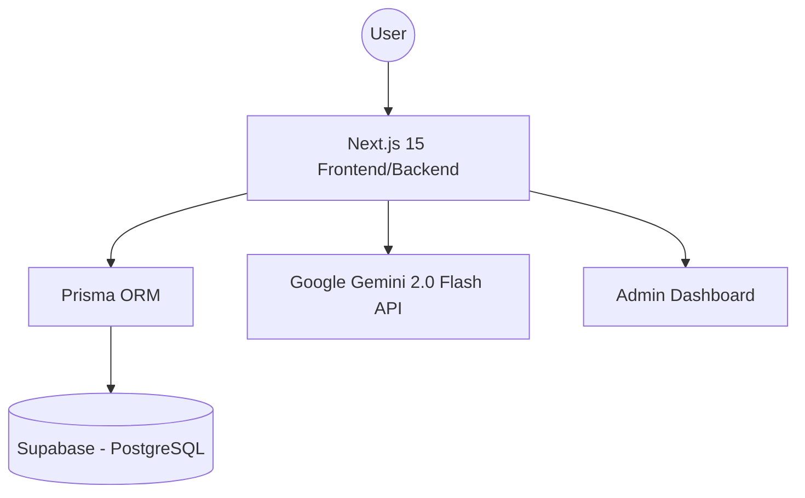

# Design Document: Virtual Try-On (Supabase & Gemini AI)

## 1. System Architecture
The application follows a modern serverless architecture using Next.js 15 (App Router).

### 1.1. High-Level Diagram

## 2. Component Design

### 2.1. Frontend Layers
- **UI Components:** Built using Tailwind CSS for a premium look. Focus on glassmorphism and smooth transitions.
- **Client Components:** Handle user photo uploads and immediate UI updates during AI processing.
- **Server Components:** Fetch product data directly from the database for SEO and performance.

### 2.2. Backend Logic (API Routes)
- **Try-On API:** Orchestrates the interaction between the user's uploaded image, the product image, and the Gemini AI API.
- **Admin API:** Handles CRUD operations for products and fetches analytics.

## 3. Database Schema
Defined using Prisma, ensuring type-safe interactions with Supabase.

### 3.1. Entity Relationship
- **Product:** Stores `id`, `name`, `category`, `image_url`, and `stock`.
- **TryOnStats:** Captures `id`, `product_id`, and `timestamp` for every successful try-on action.

## 4. AI Integration Strategy
- **Model:** `gemini-2.0-flash-exp`
- **Prompting:** Specialized prompts designed to guide the model in garment synthesis, maintaining user body proportions and clothing texture.
- **Processing:** Asynchronous handling of image generation with progress indicators for the user.

## 5. UI/UX Design System
- **Colors:** Deep Indigo and Cyan accents for a high-tech "AI" feel.
- **Typography:** Modern Sans-Serif (Inter/Outfit).
- **Interactions:** Subtle micro-animations and hover effects on product cards.

## 6. Deployment Workflow
- **CI/CD:** Automatic deployments via GitHub Actions or Vercel Integration.
- **Database Migrations:** Managed through Prisma (`prisma db push`).
- **Connection Management:** Supabase Transaction Pooler used for Vercel functions.
